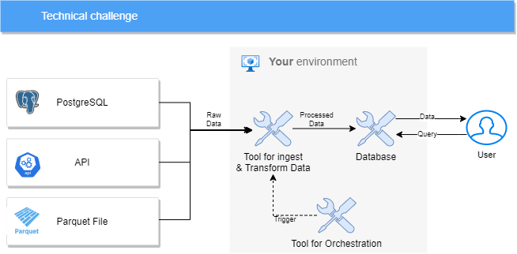
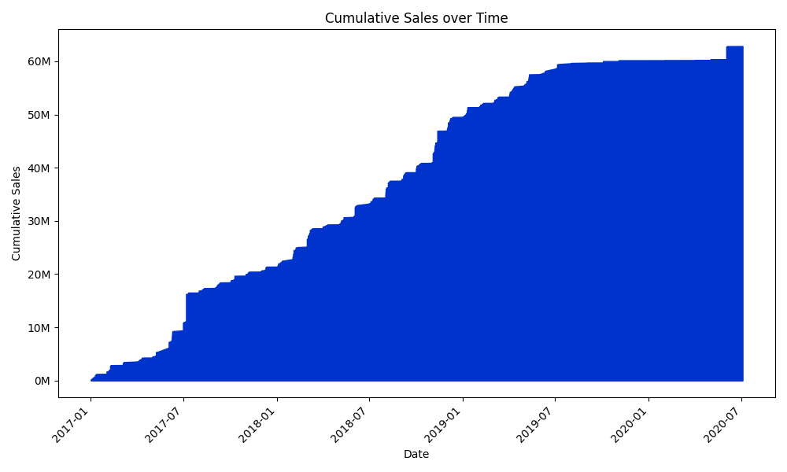
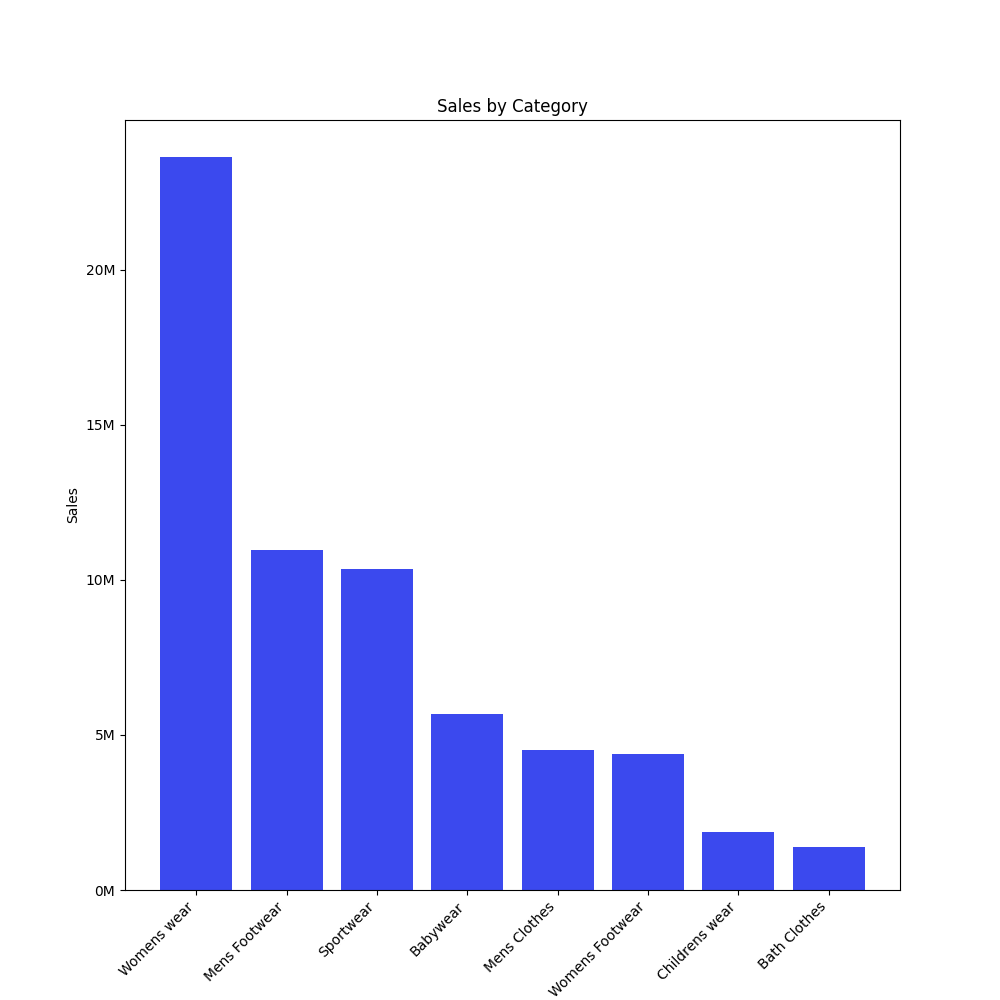
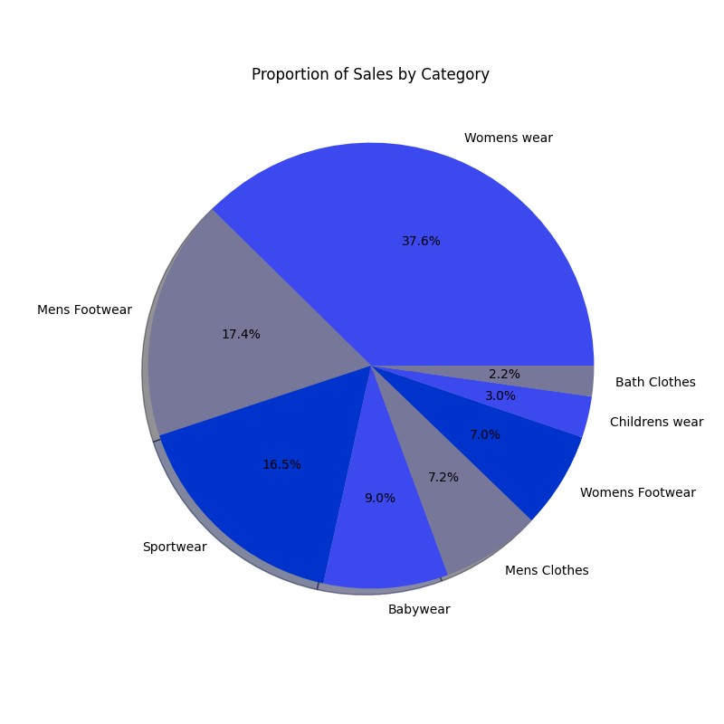
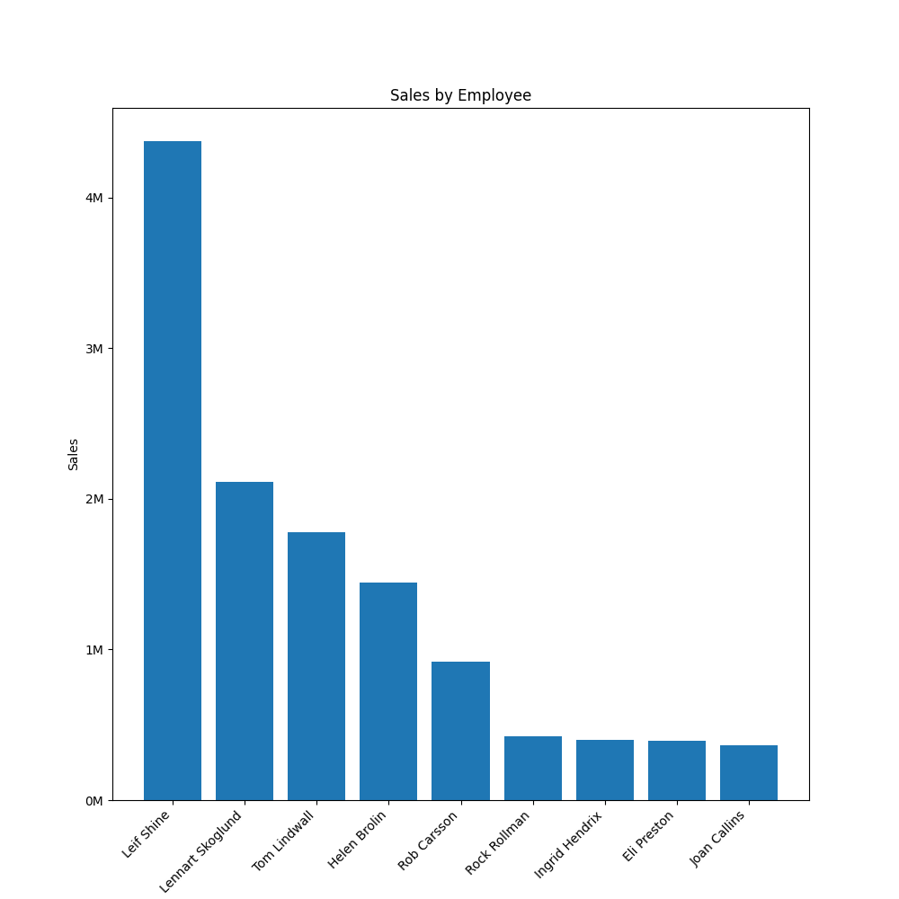

# PIPELINE DATA WITH PYTHON

The technical challenge will consist of solving the following problem. We have three data sources with the following information:

- PostgreSQL database with sales data.
- API with employee data.
- Parquet file with category data.

The objective of this challenge is to create a pipeline to move this data to a database in your environment, in a structure that you find most suitable. The end goal is to have sales, employees, and categories all in one place. We recommend using Python to ingest and process the data, and PostgreSQL as the database.

A requirement of this challenge is that the data movement should be done daily, as all sources receive new data periodically. This ensures that the data in your environment stays updated. For this purpose, it's important to have an orchestrator to automatically trigger your pipeline. We suggest using Apache Airflow as the orchestrator.

To make it clearer, here is an image of the desired architecture:



## SOLUTION

To solve this data pipeline we can use simple python data handling techiniques to transform the given data into pandas dataframes and then handle the dataframes the way we want.

Querying data from a SQL database is very simple using pandas, we just need to create the connection with the provided database and then quey the data using a SQL query. Pandas already have a function that receives the connection and the query and then return the dataframe with the database reply:

```python
df = pd.read_sql_query(query, connection)
```

Querying data from an API is more complicated, we need to do one web request for each employee listed on the query above, we can do it asynchronously to be faster, this way, all the requests are triggered together instead of triggering the next one only when the previous one is completed:

```python

# build all urls to be accessed
urls = [f"{base_url}?id={value}" for value in ids]

# declare aysnc function to perform the requests
async def get_url_data(url):
    async with aiohttp.ClientSession() as session:
        async with session.get(url) as response:
            return await response.text()
        
# create tasks for each request
tasks = [get_url_data(url) for url in urls]

# Wait for all tasks to complete
results = await asyncio.gather(*tasks)

```

This way, on the end of the execution, all the responses are going to be inside the variable results and then we can easily convert this to a dataframe:

```python
pd.DataFrame({'id_funcionario': ids, 'nome_funcionario': results})

```

The parquet file needs a low level approach, once we have the link to the file on the web we can request the bytes of the file and them convert them into a pyarrow table, this kind of table have a function that easily convert it self into a pandas dataframe:

```python
import pyarrow as pa
import pyarrow.parquet as pq

# get the file bytes from the given URL
response = requests.get(url)

# load parquet bytes data
parquet_data = pa.BufferReader(response.content)

# read the Parquet data from the bytes and create a PyArrow Table
table = pq.read_table(parquet_data)

# convert it to a pandas dataframe
df = table.to_pandas()
```

After fecthing all data we are going to have 3 dataframes, the main df, queried from the database, the names_df queried from API and the categories_df queried from the parquet web file. Now we can use pandas to easily merge them:

```python
# merge fetched data into a definitive dataframe
df = pd.merge(df, names_df, on='id_funcionario', how='left')
df = pd.merge(df, categories_df, on='id_categoria', how='left')
```

Done, we have a final dataframe, ready to be exported whatever we want.

## DATA ANALYTICS

With the result dataframe it is possible to do some data analysis. Like:

Cumulative sales over time:



Categories comparative by value and by percentage:




Employee comparative:

